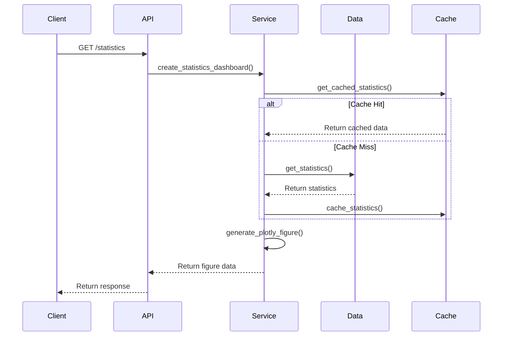
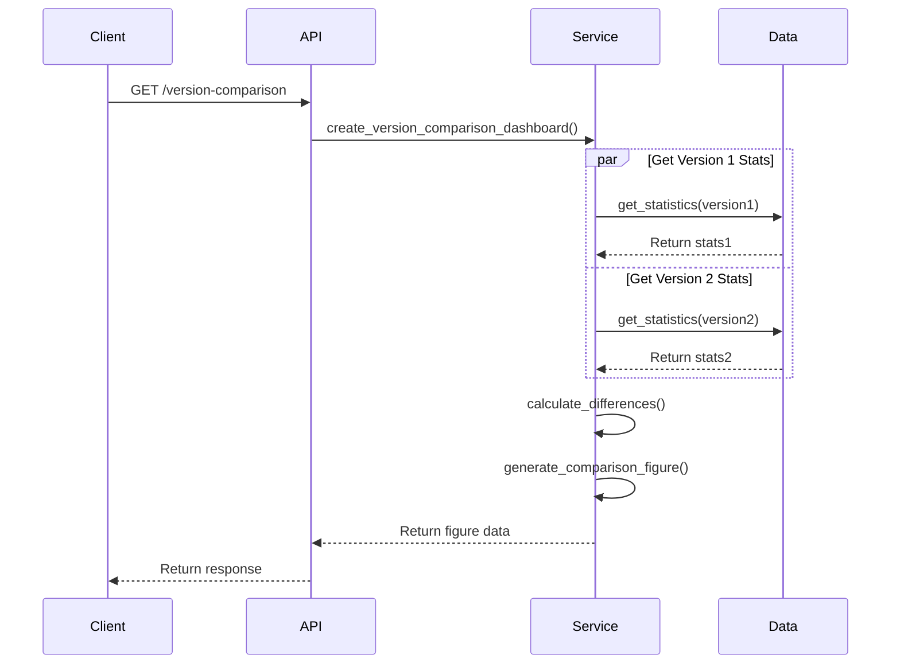

# データセット可視化機能 技術設計書

## 1. システム概要

### 1.1 目的

データセットの統計情報、バージョン間の比較、品質指標を効率的に可視化し、ユーザーがデータの特性や品質を把握しやすくする。

### 1.2 システム構成

```
+----------------+     +------------------+     +------------------+
|                |     |                  |     |                  |
|  API Layer     | --> | Service Layer    | --> | Data Layer       |
|  (FastAPI)     |     | (Visualization)  |     | (Dataset)        |
|                |     |                  |     |                  |
+----------------+     +------------------+     +------------------+
        |                      |                        |
        v                      v                        v
+----------------+     +------------------+     +------------------+
|                |     |                  |     |                  |
|  Client        |     |  Plotly          |     |  Database        |
|  (Browser)     |     |  (Visualization) |     |  (PostgreSQL)    |
|                |     |                  |     |                  |
+----------------+     +------------------+     +------------------+
```

## 2. 詳細設計

### 2.1 コンポーネント設計

#### 2.1.1 API Layer (`src/api/visualization.py`)

- 責任
  - リクエストのバリデーション
  - 認証・認可
  - レスポンスのフォーマット
  - エラーハンドリング

- 主要クラス
  ```python
  class VisualizationRouter:
      """可視化機能のAPIルーター"""
      
      @router.get("/datasets/{dataset_id}/statistics")
      async def get_statistics_dashboard(...)
      
      @router.get("/datasets/{dataset_id}/version-comparison")
      async def get_version_comparison_dashboard(...)
      
      @router.get("/datasets/{dataset_id}/quality-metrics")
      async def get_quality_metrics_dashboard(...)
      
      @router.post("/datasets/{dataset_id}/statistics/refresh")
      async def refresh_statistics(...)
  ```

#### 2.1.2 Service Layer (`src/data/visualization.py`)

- 責任
  - 可視化ロジックの実装
  - データの集計・加工
  - グラフの生成
  - キャッシュ管理

- 主要クラス
  ```python
  class VisualizationService:
      """可視化サービス"""
      
      def __init__(self, db: Session, dataset_service: DatasetService):
          self.db = db
          self.dataset_service = dataset_service
          self.cache = LRUCache(maxsize=100)
      
      def create_statistics_dashboard(...)
      def create_version_comparison_dashboard(...)
      def create_quality_metrics_dashboard(...)
      def _export_dashboard(...)
  ```

#### 2.1.3 Data Layer (`src/data/service.py`)

- 責任
  - データセットの管理
  - 統計情報の計算
  - 品質指標の計算
  - データの永続化

- 主要クラス
  ```python
  class DatasetService:
      """データセットサービス"""
      
      def get_statistics(...)
      def get_quality_metrics(...)
      def get_version_comparison(...)
  ```

### 2.2 データフロー

#### 2.2.1 統計情報ダッシュボード生成フロー



#### 2.2.2 バージョン比較ダッシュボード生成フロー



### 2.3 データモデル

#### 2.3.1 統計情報

```python
@dataclass
class Statistics:
    """統計情報"""
    numeric: Dict[str, NumericStats]
    categorical: Dict[str, CategoricalStats]
    missing_values: Dict[str, float]
    timestamp: datetime

@dataclass
class NumericStats:
    """数値データの統計情報"""
    count: int
    mean: float
    std: float
    min: float
    max: float
    percentiles: Dict[str, float]

@dataclass
class CategoricalStats:
    """カテゴリカルデータの統計情報"""
    count: int
    unique_count: int
    most_common: List[Tuple[str, int]]
    least_common: List[Tuple[str, int]]
```

#### 2.3.2 品質指標

```python
@dataclass
class QualityMetrics:
    """品質指標"""
    completeness: Dict[str, float]
    uniqueness: Dict[str, float]
    type_consistency: Dict[str, float]
    timestamp: datetime
```

### 2.4 キャッシュ設計

#### 2.4.1 キャッシュ戦略

- 統計情報のキャッシュ
  - キー: `f"stats:{dataset_id}:{version}"`
  - TTL: 1時間
  - 最大サイズ: 100エントリ

- グラフのキャッシュ
  - キー: `f"figure:{dataset_id}:{viz_type}:{params_hash}"`
  - TTL: 30分
  - 最大サイズ: 50エントリ

#### 2.4.2 キャッシュ無効化

- トリガー
  - データセットの更新
  - バージョンの追加
  - 手動での再計算

- 無効化範囲
  - 該当データセットの全バージョン
  - 関連するグラフキャッシュ

### 2.5 セキュリティ設計

#### 2.5.1 認証・認可

- 認証方式
  - JWT（JSON Web Token）
  - トークン有効期限: 1時間

- 認可チェック
  - データセットへのアクセス権限
  - バージョンへのアクセス権限
  - 操作権限（読み取り/書き込み）

#### 2.5.2 データ保護

- 機密データの取り扱い
  - 統計情報の集計時は個人情報を除外
  - アクセスログの記録
  - データマスキングの適用

- 出力ファイルの保護
  - 一時ファイルの自動削除
  - アクセス制御の適用
  - ファイル名のランダム化

### 2.6 パフォーマンス最適化

#### 2.6.1 クエリ最適化

- 統計情報の計算
  - 集計クエリの最適化
  - インデックスの活用
  - パーティショニングの検討

- データの読み込み
  - バッチ処理の活用
  - ストリーミング処理の検討
  - メモリ使用量の最適化

#### 2.6.2 非同期処理

- 長時間実行タスク
  - バックグラウンドジョブ
  - タスクキュー（Celery）
  - 進捗状況の通知

- 並列処理
  - マルチスレッド処理
  - マルチプロセス処理
  - 分散処理の検討

### 2.7 監視・運用設計

#### 2.7.1 メトリクス

- パフォーマンスメトリクス
  - レスポンスタイム
  - キャッシュヒット率
  - メモリ使用量
  - CPU使用率

- ビジネスメトリクス
  - ダッシュボード生成数
  - エラー発生率
  - ユーザーアクティビティ
  - リソース使用量

#### 2.7.2 アラート

- アラート条件
  - レスポンスタイム超過
  - エラー率の閾値超過
  - リソース使用率の閾値超過
  - キャッシュヒット率の低下

- 通知方法
  - メール通知
  - Slack通知
  - 監視ダッシュボード
  - インシデント管理システム

## 3. 非機能要件

### 3.1 パフォーマンス要件

- レスポンスタイム
  - 通常のダッシュボード生成: 3秒以内
  - 大規模データセット: 10秒以内
  - バックグラウンド処理: 非同期

- スループット
  - 通常時: 60リクエスト/分
  - ピーク時: 100リクエスト/分
  - 同時実行数: 最大10

### 3.2 可用性要件

- 稼働時間
  - 目標: 99.9%
  - 計画メンテナンス: 月1回
  - バックアップ: 日次

- 障害復旧
  - RTO（目標復旧時間）: 1時間以内
  - RPO（目標復旧時点）: 5分以内

### 3.3 スケーラビリティ要件

- 水平スケーリング
  - APIサーバー: オートスケーリング
  - データベース: レプリケーション
  - キャッシュ: 分散キャッシュ

- 垂直スケーリング
  - メモリ: 最大16GB
  - CPU: 最大8コア
  - ストレージ: 最大1TB

### 3.4 セキュリティ要件

- 認証
  - 多要素認証のサポート
  - セッション管理
  - パスワードポリシー

- 暗号化
  - 通信の暗号化（TLS 1.3）
  - データの暗号化（AES-256）
  - 鍵管理

## 4. 将来の拡張性

### 4.1 計画されている機能

1. カスタム可視化
   - ユーザー定義のグラフ
   - テンプレート機能
   - 共有設定

2. 高度な分析
   - 機械学習による異常検知
   - 予測分析
   - 相関分析

3. インタラクティブ機能
   - リアルタイム更新
   - ドリルダウン分析
   - フィルタリング

### 4.2 技術的負債

1. リファクタリング
   - コードの整理
   - テストカバレッジの向上
   - ドキュメントの更新

2. パフォーマンス改善
   - クエリの最適化
   - キャッシュ戦略の見直し
   - 非同期処理の強化

3. セキュリティ強化
   - 脆弱性スキャン
   - セキュリティテスト
   - 監査ログの強化 