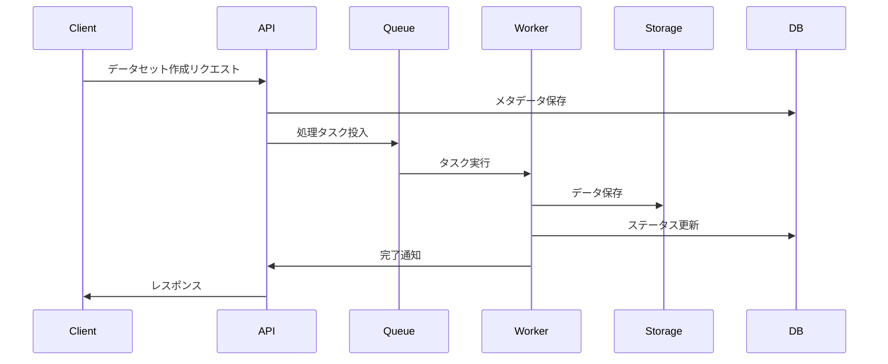
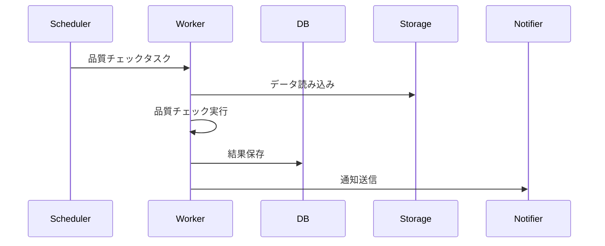

# システムアーキテクチャ

## 目次

1. [システム概要](#1-システム概要)
2. [アーキテクチャ図](#2-アーキテクチャ図)
3. [コンポーネント構成](#3-コンポーネント構成)
4. [データフロー](#4-データフロー)
5. [セキュリティ設計](#5-セキュリティ設計)
6. [スケーラビリティ](#6-スケーラビリティ)
7. [監視と運用](#7-監視と運用)

## 1. システム概要

データセット管理システムは、マイクロサービスアーキテクチャを採用した分散システムです。各サービスは独立して開発・デプロイ可能で、RESTful APIを通じて通信します。

### 1.1 主要コンポーネント

- フロントエンド（SPA）
- バックエンドAPI（FastAPI）
- データベース（PostgreSQL）
- キャッシュ（Redis）
- メッセージキュー（RabbitMQ）
- ストレージ（S3互換）
- 検索エンジン（Elasticsearch）

### 1.2 技術スタック

#### 1.2.1 バックエンド
- 言語: Python 3.9+
- フレームワーク: FastAPI
- ORM: SQLAlchemy
- タスクキュー: Celery
- データベース: PostgreSQL
- キャッシュ: Redis

#### 1.2.2 フロントエンド
- フレームワーク: React
- 状態管理: Redux Toolkit
- UIライブラリ: Material-UI
- ビルドツール: Vite
- テスト: Jest + React Testing Library

#### 1.2.3 インフラストラクチャ
- コンテナ化: Docker
- オーケストレーション: Kubernetes
- CI/CD: GitHub Actions
- モニタリング: Prometheus + Grafana
- ログ管理: ELK Stack

## 2. アーキテクチャ図

```
                                    [クライアント]
                                          │
                                          ▼
                                    [ロードバランサー]
                                          │
                    ┌──────────┬──────────┴──────────┬──────────┐
                    ▼          ▼                     ▼          ▼
              [API Gateway] [認証サービス]     [フロントエンド] [管理画面]
                    │          │                     │          │
                    └──────────┼─────────────────────┘          │
                               │                                │
                    ┌──────────┴──────────┐                     │
                    ▼                     ▼                     │
              [APIサービス群]      [メッセージキュー]            │
                    │                     │                     │
        ┌───────────┼───────────┐         │                     │
        ▼           ▼           ▼         ▼                     │
[データセット管理] [メタデータ管理] [品質管理] [ワーカー群]      │
        │           │           │         │                     │
        └───────────┼───────────┘         │                     │
                    │                     │                     │
        ┌───────────┴───────────┐         │                     │
        ▼                       ▼         ▼                     │
    [PostgreSQL]            [Redis]    [ストレージ]              │
        │                       │         │                     │
        └───────────────────────┴─────────┘                     │
                                                                │
                                                                ▼
                                                           [Elasticsearch]
```

## 3. コンポーネント構成

### 3.1 フロントエンド

#### 3.1.1 コンポーネント構造
```
src/
├── components/          # 再利用可能なコンポーネント
│   ├── common/         # 共通コンポーネント
│   ├── dataset/        # データセット関連
│   ├── metadata/       # メタデータ関連
│   └── quality/        # 品質管理関連
├── pages/              # ページコンポーネント
├── hooks/              # カスタムフック
├── store/              # Reduxストア
├── services/           # APIサービス
└── utils/              # ユーティリティ関数
```

#### 3.1.2 状態管理
```typescript
// ストアの構造
interface RootState {
  auth: AuthState;
  datasets: DatasetsState;
  metadata: MetadataState;
  quality: QualityState;
  ui: UIState;
}

// データセットの状態
interface DatasetsState {
  items: Dataset[];
  selected: Dataset | null;
  loading: boolean;
  error: string | null;
  filters: DatasetFilters;
  pagination: PaginationState;
}
```

### 3.2 バックエンド

#### 3.2.1 サービス構成
```
app/
├── api/                # APIエンドポイント
│   ├── v1/            # APIバージョン1
│   └── deps.py        # 依存関係
├── core/              # コア機能
│   ├── config.py      # 設定
│   ├── security.py    # セキュリティ
│   └── logging.py     # ロギング
├── models/            # データモデル
├── schemas/           # Pydanticスキーマ
├── services/          # ビジネスロジック
├── tasks/             # Celeryタスク
└── utils/             # ユーティリティ
```

#### 3.2.2 データモデル
```python
# データセットモデル
class Dataset(Base):
    __tablename__ = "datasets"

    id = Column(UUID, primary_key=True)
    name = Column(String, nullable=False)
    description = Column(Text)
    version = Column(String, nullable=False)
    status = Column(Enum(DatasetStatus))
    created_at = Column(DateTime, default=datetime.utcnow)
    updated_at = Column(DateTime, onupdate=datetime.utcnow)
    owner_id = Column(UUID, ForeignKey("users.id"))
    metadata = Column(JSONB)
```

### 3.3 データベース

#### 3.3.1 スキーマ設計
```sql
-- データセットテーブル
CREATE TABLE datasets (
    id UUID PRIMARY KEY,
    name VARCHAR(255) NOT NULL,
    description TEXT,
    version VARCHAR(50) NOT NULL,
    status VARCHAR(20) NOT NULL,
    created_at TIMESTAMP WITH TIME ZONE DEFAULT CURRENT_TIMESTAMP,
    updated_at TIMESTAMP WITH TIME ZONE,
    owner_id UUID REFERENCES users(id),
    metadata JSONB
);

-- メタデータテーブル
CREATE TABLE metadata (
    id UUID PRIMARY KEY,
    dataset_id UUID REFERENCES datasets(id),
    key VARCHAR(255) NOT NULL,
    value JSONB NOT NULL,
    created_at TIMESTAMP WITH TIME ZONE DEFAULT CURRENT_TIMESTAMP
);

-- 品質指標テーブル
CREATE TABLE quality_metrics (
    id UUID PRIMARY KEY,
    dataset_id UUID REFERENCES datasets(id),
    metric_name VARCHAR(255) NOT NULL,
    value NUMERIC NOT NULL,
    threshold NUMERIC,
    status VARCHAR(20) NOT NULL,
    checked_at TIMESTAMP WITH TIME ZONE DEFAULT CURRENT_TIMESTAMP
);
```

## 4. データフロー

### 4.1 データセット作成フロー



### 4.2 データ品質チェックフロー



## 5. セキュリティ設計

### 5.1 認証・認可

- JWTベースの認証
- ロールベースのアクセス制御（RBAC）
- APIキー認証（外部サービス用）
- 多要素認証（MFA）

### 5.2 データ保護

- 転送中の暗号化（TLS）
- 保存データの暗号化
- 機密情報のマスキング
- アクセスログの記録

### 5.3 セキュリティ対策

- レート制限
- CORS設定
- 入力バリデーション
- SQLインジェクション対策
- XSS対策
- CSRF対策

## 6. スケーラビリティ

### 6.1 水平スケーリング

- ステートレスAPIサービス
- ロードバランシング
- データベースレプリケーション
- キャッシュの分散

### 6.2 垂直スケーリング

- データベースパーティショニング
- インデックス最適化
- クエリ最適化
- リソース制限

### 6.3 パフォーマンス最適化

- キャッシュ戦略
- 非同期処理
- バッチ処理
- コネクションプール

## 7. 監視と運用

### 7.1 監視項目

- システムメトリクス
  - CPU使用率
  - メモリ使用率
  - ディスク使用率
  - ネットワークトラフィック

- アプリケーションメトリクス
  - レスポンスタイム
  - エラーレート
  - リクエスト数
  - キャッシュヒット率

- ビジネスメトリクス
  - アクティブユーザー数
  - データセット数
  - ストレージ使用量
  - API使用量

### 7.2 アラート設定

```yaml
# Prometheusアラートルール
groups:
  - name: application
    rules:
      - alert: HighErrorRate
        expr: rate(http_requests_total{status=~"5.."}[5m]) > 0.1
        for: 5m
        labels:
          severity: critical
        annotations:
          summary: "高エラー率を検出"

      - alert: HighLatency
        expr: http_request_duration_seconds{quantile="0.9"} > 1
        for: 5m
        labels:
          severity: warning
        annotations:
          summary: "高レイテンシを検出"
```

### 7.3 ログ管理

```python
# ログ設定
LOGGING = {
    "version": 1,
    "disable_existing_loggers": False,
    "formatters": {
        "json": {
            "()": "pythonjsonlogger.jsonlogger.JsonFormatter",
            "format": "%(asctime)s %(levelname)s %(name)s %(message)s"
        }
    },
    "handlers": {
        "console": {
            "class": "logging.StreamHandler",
            "formatter": "json"
        },
        "file": {
            "class": "logging.handlers.RotatingFileHandler",
            "filename": "app.log",
            "maxBytes": 10485760,
            "backupCount": 5,
            "formatter": "json"
        }
    },
    "root": {
        "level": "INFO",
        "handlers": ["console", "file"]
    }
}
```

## 8. 更新履歴

| 日付 | バージョン | 変更内容 |
|------|------------|----------|
| 2024-03-21 | 1.0.0 | 初版リリース |
| 2024-03-22 | 1.0.1 | セキュリティ設計セクション追加 | 